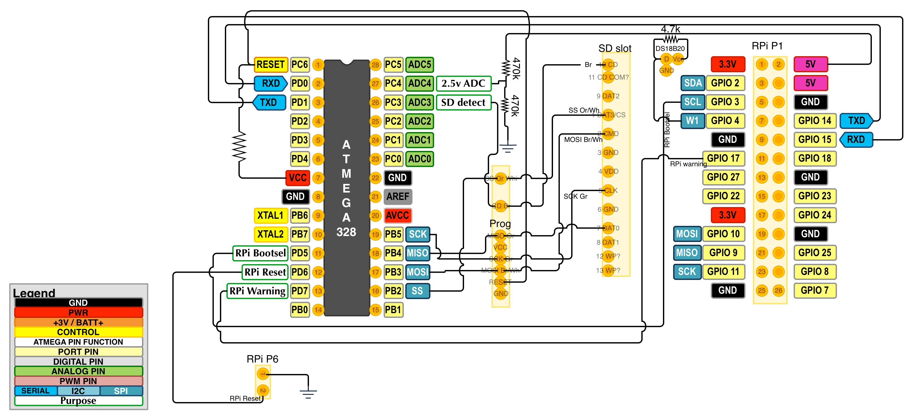

A hardware watchdog for a Raspberry Pi. It uses an atmega328 attached to the Raspberry Pi's
serial port, with a simple command line interface.

It will reset the Raspberry Pi if either a long or short watchdog timer isn't reset within 
a time period. It will also toggle a pin to alternate between booting to kernel\_emergency.img
and the normal kernel - see http://elinux.org/RPI_safe_mode . This makes it less risky to upgrading 
the boot image remotely. There are a few other features such as a bodgy random number generator
and hmac.

A rough list of functionality is in the [read handler](main.c#L1134).

I implemented this to use with [PCextreme's](https://www.pcextreme.nl/) 
[Raspberry Colocation](http://raspberrycolocation.com/).

